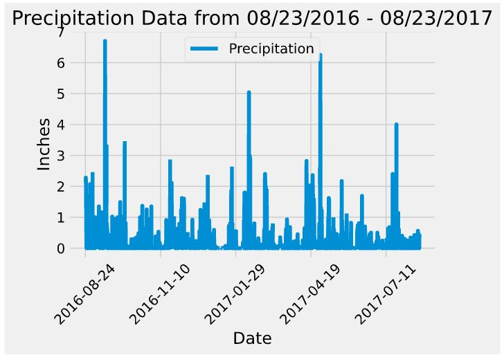

# sqlalchemy-challenge: Surfs Up!

---
## Congratulations! You've decided to treat yourself to a long holiday vacation in Honolulu, Hawaii! To help with your trip planning, you need to do some climate analysis on the area. Thankfully the hard work is now done for you.

For this challenge, I used sqlalchemy to query rainfall and temperature data in Honolulu.  Then I used Pandas to create DataFrames.  These DataFrames were used to create the charts below:

---

---

### Climate API

I also created an API that can be used to research more data.